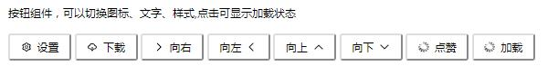

# Vue-UI-
[](https://www.travis-ci.org/Verahuan/Vue-UI-)

## 介绍
哈喽大家好！！！
这是我学习Vue过程中做的一个UI组件库
希望对你有用啦 => ♥biu~
## 开始使用
## 1.CSS样式注意事项
###因为目前这个库还在完善中，存在一些CSS样式的问题，所以希望小主在使用过程中自己设置一下~

###使用本组件需要开启border-box
---
*{box-sizing:border-box}
---
### IE8 及以上的浏览器都支持该设置
=>
### 目前还需要您亲自设置一下默认颜色等变量哦~(我后续就会改为SCSS变量啦,我会加油的！)
---
```
html {
	--button-height: 40px;
	--font-size: 14px;
	--button-active-bg: #eee;
	--button-radius: 4px;
	--border-color-hover: #666;
	--border-color: #999;
	--color: #333;
}
```
---
### IE 15 及以上浏览器都支持此样式
### script 引入svg图片
---
```
	<script src="//at.alicdn.com/t/font_1951909_qwkhghjsxff.js">
 ```
---

## 2.开始安装
 ---
 ```
 	 npm i --save vue-ui-verahuan-test
```
 ---
 引入
 ---
 	```
	 import  {button,
	 Icon,
	 Col,
	 Row,
	 Input
	 } from " vue-ui-verahuan-test" 
	 ```
 ---
 注册组件（目前还需要小可爱注册一下=**=）
 单文件组件中(举个栗子)
 ---
 ```
	<script>
	export default{
		components:{
			"g-button":Button
		}
	}
	</script>
 ```
 ---
 使用：(具体用法还在更新中...)
 ---
 模板中：
```
	<g-button> </g-button>
```
 ---
## 文档(待完善)
 button组件
### 
---
可绑定参数：
```
	props:{
		"icon":{},
		iconPosition":{},
		"loading":{				
			type:Boolean,
			default:false				
		}
		}
```
### 1.icon类型：setting download right left up down thumbs-up
### 2.iconPosition:left right
### 3.loading: true false
---
## input组件
## grid组件
  可以通过设置span参数 自行进行设置同行的不同列对比
## toast组件
   参考Framework7的toast组件进行设计，完成弹出toast/多个toast/并且可以在toast之后执行回调函数
## 提问

## 表更记录

## 联系方式

## 贡献

